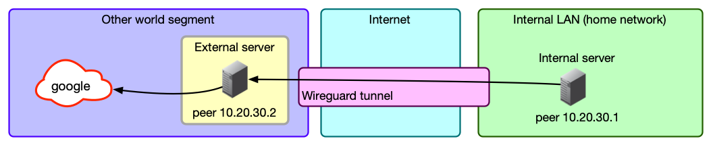
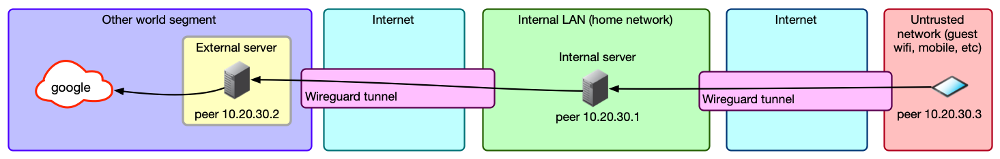
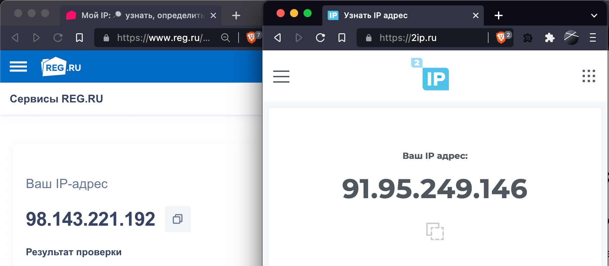
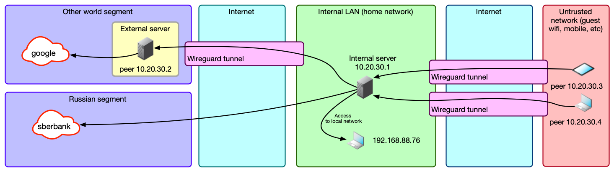

# Trickster VPN. Разбираемся с WireGuard и делаем свой умный VPN

Сейчас в РФ сложилась забавная ситуация: с одной стороны, РКН блокирует много сайтов, к которым иногда нужен доступ, с другой стороны, из-за DDoS-атак многие крупные компании ограничили доступность своих сайтов из-за границы. В этой статье я расскажу, как с этим бороться при помощи Wireguard, развернутом на своем сервере.

С блокировками зарубежного трафика ты наверняка сталкивался, если использовал зарубежный VPN. К примеру, могут не открываться pochta.ru, leroymerlin.ru, rt.ru, avito.ru.

Получается мем.


Каждый с этим борется как может. Например, на устройствах Apple [родными средствами](https://superg.ru/kak-nastroit-avtomaticheskoe-vklyuchenie-vpn-na-iphone/) можно настроить автоматизацию, которая будет запускать VPN при открытии определенных приложений (например, Twitter), а при выходе из них — выключать обратно. Но это костыль, а хочется все сделать красиво, да еще и прокачать навык работы с сетью.

Поэтому мы сейчас попробуем «включать чуть-чуть VPN».

[ INFO

При таком использовании это скорее прокси, а не VPN, но любые методы обхода блокировок теперь называют VPN, так что, сделав эту оговорку, дальше расслабимся и будем делать как все. 

]

Заодно чуть улучшим качество связи с локальными ресурсами: необходимость таскать трафик сначала до VPN вне страны, а потом обратно до сервера внутри нее драматично сказывается если не на скорости, то на задержке точно: даже на проводном интернете пинг в 4 мс до Яндекса легко превращается в 190 мс, а на мобильном интернете — из 80 мс в 240 мс. Дополнительный хоп чуть ухудшит ситуацию, но далеко не так драматично.

Делать мы все будем на основе WireGuard — это относительно новая (разрабатывается с 2016 года в отличие от OpenVPN и IPsec — первый это двухтысячные, а второй еще раньше) технология VPN, которая была создана, по сути, одним человеком — zx2c4, которого в миру зовут Джейсоном Доненфельдом. Плюсы WG — скорость (особенно для Linux, где он может работать как модуль ядра начиная с Kernel 5.6, и Windows, где модуль для ядра выпустили порядка недели назад), низкие задержки, современная криптография и простая настройка и использование конечным юзером.  

Ах да, еще UDP. UDP для туннелей это хорошо, потому что у TCP уже есть механизмы, которые позволяют ему работать на неидеальных соединениях, а UDP представляет собой именно такое соединение. А когда ты засовываешь TCP в TCP, то отказываешься от большей части этих механизмов (инкапсулированный TCP-пакет будет гарантированно доставлен другой стороне, хотя протокол допускает недоставку), но все еще несешь весь оверхед вида «хендшейк соединения для отправки хендшейка».

Не говоря уж о том, что инкапсулировать UDP в TCP — ничуть не лучшая идея, потому что сразу рушит все предположения всяких скайпов о том, что лучше пропустить пару пакетов, чем уменьшить задержку: каждый UDP пакет в этом случае будет принудительно послан заново и доставлен корректно, не считаясь с затратами времени.

Особенно для одинокого пользователя-хакера приятна работа с шифрованием: нет ни необходимости в сертификатах и удостоверяющих центрах, ни в логинах-паролях, все, что нужно — обменяться публичными ключами с пиром, с которым ты хочешь установить соединение. Для больших компаний, это, конечно, будет скорее минусом, как и то, что WG — это только базовая часть полноценной большой инфраструктуры VPN. Но именно WireGuard использовали, к примеру, в Cloudflare для своего WARP (https://blog.cloudflare.com/announcing-warp-plus/, https://blog.cloudflare.com/warp-technical-challenges/), правда, написав его собственную реализацию — boringtun.

Еще один минус WG — то, что трафик не обфусцирован, и глубокая инспекция пакетов (DPI) выявит и позволит заблокировать такое соединение (не говоря уж о блокировке UDP совсем, что почти не мешает работать с вебом, но гарантированно ломает WireGuard). Для скрытия трафика рекомендуется использовать специализированное ПО — Cloak, Obfsproxy, Shadowsocks, Stunnel, SoftEther, SSTP, или, в конце-концов, простой SSH. Часть из этих инструментов может работать совместно с WG, а часть способа его заменять в качестве инструмента стеганографии: WG изначально создавался под скорость и криптографическую защищенность.

Если очень упрощать, ключи работают следующим образом: у нас есть закрытый (приватный) ключ, из которого можно сгенерировать открытый, или публичный. Наоборот, из открытого ключа получить закрытый мы никак не можем. Затем мы шифруем с помощью закрытого ключа какую-то строку, а при помощи открытого — расшифруем ее и тем самым убедимся, что у собеседника точно есть закрытый ключ, а значит, он тот, за кого себя выдает. Таким образом, мы можем без проблем передавать открытый ключ — он всего лишь позволяет проверить подлинность автора, но не притвориться им.

Это как в SSH — публичный ключ лежит на сервере, где его потеря небольшая беда: все что сможет сделать с ним злоумышленник это положить его на свой сервер, чтобы вы к нему могли подключиться с помощью закрытого ключа.  

Так вот, в WG первый этап подключения заключается в том, что каждая сторона с помощью зашифрованного приватным ключом сообщения доказывает собеседнику, что она именно она: это проверяется публичным ключом.

Второй этап — создание с помощью этих ключей и матана симметричных ключей для шифрования самого трафика. Благодаря тому, что расшифровать зашифрованное публичным ключом нельзя без приватного, мы сможем создать ключ для симметричного шифрования и отправить его по защищенному каналу. Этот шаг необходим потому, что симметричное шифрование — это гораздо менее ресурсоемкая операция, и минус у нее только один: необходимо синхронизировать ключ между сторонами, при том, что перехват ключа третьей стороной ведет к возможности расшифровки трафика.

Но эта проблема решается с помощью ассиметричной схемы. Это называется «Протокол Диффи — Хеллмана» — способ защищенного получения общего секретного ключа. В WG используется ECDH — вариация Диффи-Хеллмана на эллиптических кривых. Первые два этапа в терминах WG называются рукопожатием или хендшейком.  
Затем симметричные ключи используются для шифрования трафика. Раз в две минуты происходит новое рукопожатие, и сессионные ключи меняются.

Разумеется, в реальности всё немного сложнее — например, отправляются не сами ключи, а сгенерированные на их основе эферемные ключи, которые удаляются сразу после операции. Заинтересовавшихся подробностями отправляю к [краткому описанию на сайте Wireguard](https://www.wireguard.com/protocol/).  

Мы же перейдем к более практическим действиям. 

## Шаг 1. Создаем и настраиваем два сервера

Один сервер будет внутри страны — через него будет идти трафик на локальные ресурсы, а второй — за границей. Далее я их буду называть **local** и **external**.

Идеально, если **local** будет в твоей домашней сети, потому что при этом трафик на внешние ресурсы не будет отличаться от твоего домашнего трафика. Но для этого нужен какой-то хост дома, белый IP и возможность пробросить порт. У меня это виртуалка на домашнем сервере, но наверное, подойдет и Raspberry Pi или аналогичный одноплатник 

[ INFO

Вариант с одноплатником я не тестировал, и не уверен, что он сработает. Raspberry Pi придется маршрутизировать весь трафик с устройств и держать в памяти около 11 тысяч маршрутов; ресурсов на это может не хватить.

]

Если дома хоста нет, можно взять любой сервер у хостера VDS. Увы, некоторые сайты блокируют подсети хостеров, опасаясь ботов, так что это менее предпочтительный вариант.

А вот внешнюю машину можно арендовать и у хостера. К примеру, у RU VDS и VDSina есть зарубежные площадки. А можно выбрать иностранного хостера, если найдешь способ оплачивать его услуги. Например, я использую исландский 1984.hosting, созданный специально для параноиков.

Считаем, что на обоих серверах у нас Debian 11.

Ставим нужные нам пакеты:

```bash
apt update && apt install -y wireguard iptables ipcalc qrencode curl jq traceroute dnsutils ufw
```

Включаем перенаправление трафика: в этом случае сервер, получив пакет, который предназначается ни одному из его IP-адресов, не отбросит его, а попытается перенаправить в соответствии со своими маршрутами.

```bash
echo "net.ipv4.ip_forward=1" > > /etc/sysctl.conf
echo "net.ipv4.conf.all.forwarding=1" > > /etc/sysctl.conf
sysctl -p /etc/sysctl.conf
```

Опционально (но очень удобно) сразу поменять hostname обоих серверов, чтобы не запутаться, где какая консоль:

```bash
hostnamectl set-hostname trickster-internal
```
```bash
hostnamectl set-hostname trickster-external
```

## Шаг 2. Настраиваем WireGuard для связи двух серверов

Для начала генерируем ключи. Запускаем два раза **wg genkey** и получаем два приватных ключа:

```bash
root@trikster-internal:~# wg genkey
kOd3FVBggwpjD3AlZKXUxNTzJT0+f3MJdUdR8n6ZBn8=
root@trikster-internal:~# wg genkey
6CCRP42JiTObyf64Vo0BcqsX6vptsqOU+MKUslUun28=
```

Утилита wg genkey не делает ничего волшебного, это просто аналог чего-то в таком духе:

```bash
echo $RANDOM | md5sum | head -c 32 | base64
```

Только наверняка более случайное: мы просто генерируем 32 байта случайных значений и представляем их в виде Base64.

Создаем два конфига. Один на **internal**:  

##### /etc/wireguard/wg-internal.conf
```ini
[Interface]
Address = 10.20.30.1/32
ListenPort = 17968
PrivateKey = kOd3FVBggwpjD3AlZKXUxNTzJT0+f3MJdUdR8n6ZBn8=
PostUp = iptables -t nat -A POSTROUTING -o `ip route | awk '/default/ {print $5; exit}'` -j MASQUERADE
PostUp = ip rule add from `ip addr show $(ip route | awk '/default/ { print $5 }') | grep "inet" | grep -v "inet6" | head -n 1 | awk '/inet/ {print $2}' | awk -F/ '{print $1}'` table main
PostDown = iptables -t nat -D POSTROUTING -o `ip route | awk '/default/ {print $5; exit}'` -j MASQUERADE
PostDown = ip rule del from `ip addr show $(ip route | awk '/default/ { print $5 }') | grep "inet" | grep -v "inet6" | head -n 1 | awk '/inet/ {print $2}' | awk -F/ '{print $1}'` table main
```

Второй на **external**:
  
##### /etc/wireguard/wg-external.conf
```ini
[Interface]
Address=10.20.30.2/32
PrivateKey=6CCRP42JiTObyf64Vo0BcqsX6vptsqOU+MKUslUun28=
PostUp = iptables -t nat -A POSTROUTING -o `ip route | awk '/default/ {print $5; exit}'` -j MASQUERADE
PostDown = iptables -t nat -D POSTROUTING -o `ip route | awk '/default/ {print $5; exit}'` -j MASQUERADE
```

Секция **[Interface]** — это настройки конкретного сетевого интерфейса Wireguard, того, что будет виден в ```ip a```. Название интерфейса берется из названия текущего файла конфигурации. У одного интерфейса всегда одна ключевая пара: у пиров этого интерфейса одинаковый публичный ключ.

Но никто не мешает, если хочется, сделать для каждого пира отдельный конфиг и отдельный интерфейс (правда, на сотнях клиентов это будет неудобно).

Управляются интерфейсы обычно при помощи утилиты **wg-quick**:  
`wg-quick down wg-external` и `wg-quick up wg-external`

Утилита **wg-quick** — это, на самом деле, 400 строк на баше, которые автоматизируют часто используемые вещи: например, установку маршрутов. Наличие туннеля само по себе не дает ничего, кроме защищенной «трубы», за которой находится другой пир. Чтобы твой запрос в браузере попал в интерфейс, системе надо явно сказать: «Маршрутизируй, пожалуйста, пакеты с таким-то адресом назначения вот в этот сетевой интерфейс».

Именно этим занимается **wg-quick**. Ну еще и настройкой адресов DNS, указанных в конфиге, установкой MTU, и еще парой вещей. Но ничего сложного в этом нет, достаточно сделать `cat /usr/bin/wg-quick`, чтобы посмотреть на эту логику и, если надо, сделать то же самое руками.

- **Interface-Address** — это IP текущего пира. Вся адресация в WG статическая. С одной стороны, это упрощает настройку и бутстрап, с другой стороны, усложняет работу, если у вас очень много клиентов.  
- **ListenPort** — это UDP-порт для подключения извне. Если не указать, будет прослушивать 51820.
- **Interface-PostUp** и **PostDown** — это скрипты, которые выполняются после поднятия и после остановки интерфейса. Есть еще **PreUP** и **PreDown**.  

Кроме публичных и приватных ключей есть еще опция **PresharedKey**, которая обеспечивает дополнительное шифрование симметричным шифром. Ключ генерируется командой `wg genpsk` и кладется в **PresharedKey** в секциях **Peer** на обоих пирах. Если не использовать эту опцию, нагрузка по шифрованию и расшифровке не вырастет: если ключ не указан, используется нулевое значение ключа.

Чтобы по-настоящему обеспечить пост-квантовую безопасность (невозможность расшифровки данных квантовыми компьютерами), разработчики рекомендуют дополнительный внешний квантово-устойчивый механизм хендшейка — например, SIDH, который Microsoft пиарит именно в таком контексте. Созданный им общий ключ можно использовать в качестве **PresharedKey**.

Заклинания в PostUp достаточно просты. Вот команда для подстановки имени сетевого интерфейса, куда по-умолчанию выполняется маршрутизация:

    ip route | awk '/default/ {print $5; exit}'

Как правило это то интерфейс, обращенный к провайдеру или роутеру.

Таким образом, страшная команда превращается в такую: 

    iptables -t nat -A POSTROUTING -o eth0 -j MASQUERADE

Здесь происходит включение NAT в режиме маскарада: сервер будет отправлять пришедшие ему пакеты во внешнюю сеть, подменяя адрес отправителя на свой, чтобы ответы на эти пакеты тоже приходили ему, а не исходному отправителю.

Вторая команда уже немного сложнее, но она подставляет IP-адрес дефолтного маршрута.

```bash
`ip addr show $(ip route | awk '/default/ { print $5 }') | grep "inet" | grep -v "inet6" | head -n 1 | awk '/inet/ {print $2}' | awk -F/ '{print $1}'`
```

Сначала мы получаем, как и выше, сетевой интерфейс маршрута по умолчанию:

```bash
root@:~# ip route | awk '/default/ { print $5 }'
enp1s0
```

Потом данные о состоянии этого интерфейса

```bash
root@:~# ip route | awk '/default/ { print $5 }'
    inet 192.168.88.70/24 brd 192.168.88.255 scope global dynamic enp1s0
```

И дальше вытаскиваем оттуда адрес, в данном случае 192.168.88.70.
Команда становится такой:

```
ip rule add from 95.93.219.123 table mainё
```

Это необходимо для сервера **internal**, потому что иначе при активации маршрута `0.0.0.0/0` он начинает пересылать ответы на пакеты, приходящие ему на внешние адреса через туннель WG. Сервер на том конце, конечно, пересылает их по назначению, но тут уже не готов отправитель пакета: он присылает что-то на внешний адрес сервера **internal**, а ответ ему приходит с **external**.

Естественно, при включенном rp_filter пакет отбрасывается. В этом случае сервер перестает быть доступным, например, по SSH снаружи. К нему придется коннектиться только по внутреннему IP Wireguard. Отключать rp_filter — это из пушки по воробьям, а вот дополнительное правило исправляет ситуацию. В оба конфига надо добавить секцию **Peer**, чтобы связать сервера друг с другом.

[ INFO

Я намеренно не привожу готовые конфиги, потому что хочу показать механизм создания конфигов в ручном режиме. В свое время я генерировал конфиги утилитами типа easy-wg-quick или веб-сервисами, которые спрашивают тебя о названии клиента и красиво показывают QR-код. Это отнюдь не способствуют пониманию того, как работает WG на самом деле и может вызвать проблемы.

]

Генерируем из приватного ключа публичный (вот в pubkey как раз происходит криптомагия):

```bash
echo "kOd3FVBggwpjD3AlZKXUxNTzJT0+f3MJdUdR8n6ZBn8=" | wg pubkey
MxnOnIlKfSyZyRutnYyoWHb3Izjalgf1t8F1oPJiyyw=
```

Это публичный ключ сервера **internal**, его мы помещаем в секцию **Peer** на **external**:

##### /etc/wireguard/wg-external.conf
```ini
[Peer]
PublicKey=MxnOnIlKfSyZyRutnYyoWHb3Izjalgf1t8F1oPJiyyw=
AllowedIPs=10.20.30.0/24
Endpoint=195.2.79.13:17968
PersistentKeepalive=25
```

Там же, в **Endpoint** указываем адрес сервера **internal** и порт, который мы задали в **ListenPort**.

С **AllowedIPs** при использовании wg-quick возникает небольшая путаница. Это именно список IP-адресов, с которых мы разрешаем принимать пактеы из туннеля. Если прилетит что-то с другим src, оно будет отброшено.

Wg-quick разумно считает, что если есть какие-то устройства, которые могут послать пакет, значит, пакеты к этим устройствам надо маршрутизировать туда же, и создает маршруты на эти адреса, указывающие на туннель пира.

В этих примерах **AllowedIPs** можно читать как «адреса, трафик на которые будет маршрутизироваться в туннель этого пира, и с которых пир сможет отправить что-то в туннель».

То есть, пункт `AllowedIPs = 10.20.30.3/32` означает, буквально, «только запросы на 10.20.30.3 (адрес пира WG) отправлять в туннель», то есть дать доступ только до машины этого клиента.  
Пункт `AllowedIPs = 192.168.88.0/24` означает, что при запросе адреса из этой подсети запрос уйдет в туннель клиента, и если у него включен форвардинг и ему доступна эта подсеть, то к ней можно будет получить доступ.

`AllowedIPs = 0.0.0.0/0` означает, что в туннель надо маршрутизировать вообще весь трафик. Правда, это не относится к трафику, например, локальной сети: приоритет у маршрута, который создается из маски подсети и адреса шлюза, выше, чем у 0.0.0.0/0. Также маршрут 0.0.0.0/0 перебьют маршруты других пиров, если они будут в конфиге.

В данном случае `AllowedIPs=10.20.30.0/24` означает, что трафик с **external** в подсеть 10.20.30.0-10.20.30.255 будет уходить в туннель к **internal**. В принципе, особой нужды в этом нет, **external** у нас исключительно выходная нода. Но вдруг мы как-нибудь захотим зайти оттуда по SSH на какую-нибудь другую машину.

Повторяем генерацию публичного ключа с **external**:

```bash
root@:~# echo "6CCRP42JiTObyf64Vo0BcqsX6vptsqOU+MKUslUun28=" | wg pubkey
FulnUTovyyfgn5kmgPkcj2OjKRFGeLkaTsHtAOy6HW8=
```

Мы получаем публичный ключ сервера **external** и помещаем его в секцию **Peer** сервера **internal**.

##### /etc/wireguard/wg-internal.conf
```ini
[Peer] #external node
PublicKey = FulnUTovyyfgn5kmgPkcj2OjKRFGeLkaTsHtAOy6HW8=
AllowedIPs = 10.20.30.2/32, 0.0.0.0/0
```

**AllowedIPs** тут ```10.20.30.2/32, 0.0.0.0/0```. Этим мы указываем, что за туннелем находится конкретный IP 10.20.30.2, и, помимо этого, пробрасываем весь трафик, не связанный другими маршрутами, в этот туннель: **external** у нас основная выходная нода VPN.

Поэтому по умолчанию весь трафик будет направляться через нее, так как зарубежных маршрутов больше, чем российских, и логичнее фильтровать именно российские, а зарубежный трафик пустить по умолчанию через ноду в другой стране.

Итак, два конфига.

##### /etc/wireguard/wg-internal.conf
```ini
[Interface]
Address = 10.20.30.1/32
ListenPort = 17968
PrivateKey = kOd3FVBggwpjD3AlZKXUxNTzJT0+f3MJdUdR8n6ZBn8=
PostUp = iptables -t nat -A POSTROUTING -o `ip route | awk '/default/ {print $5; exit}'` -j MASQUERADE
PostUp = ip rule add from `ip addr show $(ip route | awk '/default/ { print $5 }') | grep "inet" | grep -v "inet6" | head -n 1 | awk '/inet/ {print $2}' | awk -F/ '{print $1}'` table main
PostDown = iptables -t nat -D POSTROUTING -o `ip route | awk '/default/ {print $5; exit}'` -j MASQUERADE
PostDown = ip rule del from `ip addr show $(ip route | awk '/default/ { print $5 }') | grep "inet" | grep -v "inet6" | head -n 1 | awk '/inet/ {print $2}' | awk -F/ '{print $1}'` table main

#external node
[Peer]
PublicKey = FulnUTovyyfgn5kmgPkcj2OjKRFGeLkaTsHtAOy6HW8=
AllowedIPs = 10.20.30.2/32, 0.0.0.0/0
```

##### /etc/wireguard/wg-external.conf
```ini
[Interface]
Address = 10.20.30.2/32
PrivateKey = 6CCRP42JiTObyf64Vo0BcqsX6vptsqOU+MKUslUun28=
PostUp = iptables -t nat -A POSTROUTING -o `ip route | awk '/default/ {print $5; exit}'` -j MASQUERADE
PostDown = iptables -t nat -D POSTROUTING -o `ip route | awk '/default/ {print $5; exit}'` -j MASQUERADE

#internal node
[Peer]
PublicKey = MxnOnIlKfSyZyRutnYyoWHb3Izjalgf1t8F1oPJiyyw=
AllowedIPs = 10.20.30.0/24
Endpoint = 195.2.79.13:17968
PersistentKeepalive = 25
```

Теперь можно поднять туннели на обоих серверах:

```bash
root@trikster-external:~# wg-quick down wg-external ; wg-quick up wg-external
```

```bash
root@trikster-internal:~# wg-quick down wg-internal ; wg-quick up wg-internal
```

Проверяем, что туннели активны командой `wg`:

```bash
root@trikster-internal:~# wg
...
peer: FulnUTovyyfgn5kmgPkcj2OjKRFGeLkaTsHtAOy6HW8=
  endpoint: 51.159.187.77:36276
  allowed ips: 10.20.30.2/32, 0.0.0.0/0
  latest handshake: 13 seconds ago
  transfer: 180 B received, 92 B sent
```

```bash
root@trikster-external:~# wg
...
peer: MxnOnIlKfSyZyRutnYyoWHb3Izjalgf1t8F1oPJiyyw=
  endpoint: 195.2.79.13:17968
  allowed ips: 10.20.30.0/24
  latest handshake: 10 seconds ago
  transfer: 92 B received, 180 B sent
  persistent keepalive: every 25 seconds
```

Если видим «latest handshake: ... seconds ago» и байты и в **received** и в **sent**, значит, все хорошо. Если байты только в **send**, без хендшейка и полученных данных, значит где-то в конфиге ошибка или серверы недоступны друг для друга.

Если что-то пошло не так, и отвалился SSH, то достаточно перезагрузить сервер — активные туннели сбросятся.

Если же все хорошо, и доступ к серверам сохранился, ставим туннели в автозапуск:

```bash
root@trikster-internal:~# systemctl enable wg-quick@wg-internal.service
```
```bash
root@trikster-external:~# systemctl enable wg-quick@wg-external.service
```

Попробуем посмотреть маршрут (рекомендую замечательную утилиту `mytraceroute`, `mtr`) без туннеля:

```bash
root@trikster-internal:~# wg-quick down wg-internal && sleep 10 && mtr -r google.com
HOST: trikster-internal.local     Loss%   Snt   Last   Avg  Best  Wrst StDev
  1.|-- host-89-22-232-243.hosted  0.0%    10    0.3   5.4   0.3  49.8  15.6
  2.|-- 172.31.0.1                 0.0%    10    0.3  19.8   0.3 122.2  42.6
  3.|-- 109.239.138.90             0.0%    10    1.5   1.9   1.4   3.0   0.6
  4.|-- 91.108.51.4                0.0%    10   11.4  11.4  11.3  11.7   0.1
  5.|-- 178.18.227.12.ix.dataix.e  0.0%    10   11.0  17.9  11.0  77.0  20.8
```

И с туннелем:

```bash
root@trikster-internal:~# wg-quick up wg-internal && sleep 10 &&  mtr -r google.com
HOST: trikster-internal.local     Loss%   Snt   Last   Avg  Best  Wrst StDev
  1.|-- 10.20.30.2                 0.0%    10   51.3  51.3  51.2  51.4   0.1
  2.|-- 10.200.100.0               0.0%    10   51.4  51.4  51.2  51.6   0.1
  3.|-- 10.197.37.65               0.0%    10   52.5  52.2  52.0  52.5   0.2
  4.|-- 10.197.0.41                0.0%    10   52.2  52.2  52.1  52.5   0.1
  5.|-- 10.197.0.44                0.0%    10   52.0  52.2  51.9  52.4   0.1
  ```

Все хорошо, трафик идет через внешний сервер — сначала на 10.20.30.2, который у нас назначен выходной нодой, а потом через его маршрутизаторы.

У нас получилась примерно следующая схема.



## Шаг 3. Добавляем конфиг клиента

Создаем конфиг клиента, конечного устройства-пользователя VPN. За основу берем `wg-external.conf`, потому что это точно такой же клиент, который подключается к **internal**: разница только в том, что **external** будет получать пакеты, а наш клиент — отправлять.

Генерируем ему сразу пару публичный-приватный ключ:

```bash
root@trikster-internal:~# prk=`wg genkey` && pbk=`echo $prk | wg pubkey` && printf "Private: $prk\nPublic: $pbk\n"
Private: iPK7hYSU8TLVRD+w13nd3aGSYNLfnTx6zwdRzKcGb1o=
Public: 26Vhud00ag/bdB9molvSxfBzZTlzdO+aZgrX3ZDncSg=
```

Конфиг почти такой же (файл уже на вашем устройстве, не на сервере):

##### /etc/wireguard/wg-notebook-client.conf
```ini
[Interface]
Address = 10.20.30.3/32
PrivateKey = iPK7hYSU8TLVRD+w13nd3aGSYNLfnTx6zwdRzKcGb1o=
DNS = 1.1.1.1, 8.8.8.8

#internal node
[Peer]
PublicKey = MxnOnIlKfSyZyRutnYyoWHb3Izjalgf1t8F1oPJiyyw=
AllowedIPs = 0.0.0.0/0
Endpoint = 195.2.79.13:17968
PersistentKeepalive = 25
```

Тут у нас добавилась опция `PersistentKeepalive`. Дело в том, что роутеры в цепочке между двумя пирами ничего не знают о сессии WG, а знают только о потоке UDP-пакетов. Для маршрутизации UDP-пакетов за NAT они создают у себя табличку, в которую записывают, кто куда и на какой порт отправил пакет. И если с destination-адреса/порта приходит UPD-пакет, то они определяют, куда его отправить по это таблице, делая вывод, что если сервер B недавно отправил пакет серверу А, то ответ от сервера А на этот же адрес и порт скорее всего надо переслать серверу B.

В UDP, в отличие от TCP, нет никаких договоренностей о поддержании сессии, так как нет и самого понятия сессии. WG же построен таким образом, что при отсутствии трафика, попадающего в туннель, не будет и трафика между пирами, только хедшейки раз в две минуты. Опция `PersistentKeepalive` заставляет его посылать пустые пакеты каждые 25 секунд, что предотвращает потерю маршрута на промежуточных роутерах. Без этого была бы возможна ситуация, когда раз за разом отправляем пакеты, до второго пира они не доходят, а он об этом не знает.

Дальше мы добавляем еще одну секцию **Peer** в конфиг на **internal** — для клиента:

```ini
#notebook-client node
[Peer]
PublicKey = 26Vhud00ag/bdB9molvSxfBzZTlzdO+aZgrX3ZDncSg=
AllowedIPs = 10.20.30.3/32
```

Перезапускаем туннель на **internal** (`wg-quick down/up`), подключаемся… Есть хендшейк! Данные пошли.

Теперь смотрим свой IP (например, [на reg.ru](https://www.reg.ru/web-tools/myip)): видим IP **external** ноды, и другую страну.

Таким же образом создаем конфиги для других клиентов. Если это мобильные устройства, то удобнее показать им QR-код. Он делается следующим образом. Создаем в текущей папке конфиг как обычно (конечно, с новыми ключами и другим IP), называем, например, `wg-moblie-client.conf`. А дальше прямо командой в консоли создаем QR-код, который сканируем с телефона:

```bash
qrencode -t ansiutf8 < wg-moblie-client.conf
```

Это удобнее, чем копирование файлов, но тебе никто не мешает скинуть `wg-moblie-client.conf` на телефон или вообще ввести значения семи полей вручную.

Теперь наша схема выглядит следующим образом.



В целом, все готово: мы только что сделали очень странный двуххоповый VPN. Надо это дело отметить! Открываем «Сбермаркет», чтобы заказать пивка...

 

Ах да, мы же с этой проблемой и собирались бороться. Неловко!
Давай доделаем.

## Шаг 4. Добавляем регионально-зависимую маршрутизацию

Как ты помнишь, мы отправляем все данные с клиента на **internal**, тот все данные отправляет на **external**, а тот уже своему провайдеру. Также мы помним, что у нас на **internal** «слабый» маршрут 0.0.0.0/0, который перебивается любыми другими маршрутами, а сам **internal** находится в российском сегменте. Значит, все, что нам надо — это как-то перехватить запросы на российские IP на уровне **internal** и перенаправить их не в туннель WG до **external**, а напрямую в сетевой порт самого сервера, в тот, через который он получает доступ в православный, российский интернет со скрепами и девицами в кокошниках.

Давай проверим предположение. На клиенте получим IP того же «Сбермаркета» (`nslookup sbermarket.ru`), и посмотрим, как туда идет трафик (`traceroute 212.193.158.175`):

```bash
HOST: vvzvladMBP14.local          Loss%   Snt   Last   Avg  Best  Wrst StDev
  1.|-- 10.20.30.1                 0.0%    10    3.9   4.3   3.2   6.5   1.1
  2.|-- 10.20.30.2                 0.0%    10   55.7  56.0  54.6  59.2   1.2
  3.|-- 10.200.100.0               0.0%    10   55.5  56.1  54.9  58.6   1.1
  4.|-- 10.197.37.65               0.0%    10   56.0  56.9  55.4  60.1   1.7
  5.|-- 10.197.0.41                0.0%    10   56.1  57.0  55.7  60.9   1.6
  ```

Ага, как и ожидалось, через **external**.

Теперь создадим маршрут до этого адреса через дефолтный шлюз и устройство. Их можно узнать в `ip r`:

```bash
root@trikster-internal:~# ip r
default via 195.2.79.1 dev ens3 onlink
10.20.30.2 dev wg-internal scope link
...
```

`195.2.79.1` и `ens3` — это и есть нужные нам данные. Используем уже знакомые подстановочные команды и создадим новый маршрут:

```bash
target_ip="212.193.158.175/32"
gateway=`ip route | awk '/default/ {print $3; exit}'`
gateway_device=`ip route | awk '/default/ {print $5; exit}'`
ip route add $target_ip via $gateway dev $gateway_device
```

Проверяем:

```bash
root@trikster-internal:~# ip r
default via 195.2.79.1 dev ens3 onlink
10.20.30.2 dev wg-internal scope link
10.20.30.3 dev wg-internal scope link
195.2.79.0/24 dev ens3 proto kernel scope link src 195.2.79.13
==> 212.193.158.175 via 195.2.79.1 dev ens3 <==
```

Да, на последнем месте у нас нужный маршрут.

Теперь повторяем команду `traceroute -r 212.193.158.175` на клиенте, и видим, что трейс другой:

```bash
HOST: vvzvladMBP14.local          Loss%   Snt   Last   Avg  Best  Wrst StDev
  1.|-- 10.20.30.1                 0.0%    10    4.3   7.9   3.7  29.1   7.9
  2.|-- host-89-22-232-243.hosted  0.0%    10    4.6   4.9   3.8   9.2   1.6
  3.|-- 172.31.0.1                 0.0%    10   25.9   8.4   3.3  25.9   6.9
  4.|-- sw1-m9p2-msk.ip.ngenix.ne  0.0%    10    6.2   5.7   4.0   7.3   1.0
  5.|-- cdn.ngenix.net             0.0%    10    3.8   5.0   3.8   8.4   1.3
```

Ура, «Сбермаркет» открывается! Правда, такое сработает не со всеми сервисами: например, JavaScript на сайте может дернуть другой сервер, а не тот, в адрес которого резолвится имя домена, и до которого нет маршрута.

Можно сходить на [asnlookup.com](https://asnlookup.com/), вбить туда адрес, и получить принадлежность адреса к AS и заодно список подсетей этой autonomous system (AS34879, OOO Sovremennye setevye tekhnologii). С большой вероятностью для более-менее крупных компаний это и будет их сетевая инфраструктура (ну или по крайней мере, инфраструктура, относящаяся к конкретному сайту), прописав для которой маршруты, ты обеспечишь доступ на нужный сайт или сервис. Для мелких сайтов ты скорее всего получишь AS хостера или дата-центра, но, во-первых, это тоже сработает, а во-вторых, мелкие сайты обычно и не закрывают иностранные диапазоны, потому что не испытывают проблем с DDoS из-за границы.

Но можно сделать проще и автоматически: засунуть в маршруты вообще все адреса российского сегмента (спасибо [статье](https://habr.com/en/post/659655/) на «Хабре») и не париться о ручном добавлении.

RIPE отдает их все в виде JSON вот по этому адресу:

[https://stat.ripe.net/data/country-resource-list/data.json?resource=ru](https://stat.ripe.net/data/country-resource-list/data.json?resource=ru)

Утилита jq преобразует из JSON в список подсетей:

```bash
curl https://stat.ripe.net/data/country-resource-list/data.json?resource=ru | jq -r ".data.resources.ipv4[]"
```

Правда, почему-то некоторые адреса там в формате `195.85.234.0-195.85.236.255`, а не в виде подсети. Их там с десяток, можно было бы так и оставить, но если уж начали делать, давай сделаем до конца и красиво. Нам понадобится утилита ipcalc.

```bash
root@trikster-internal:~# ipcalc 195.85.234.0-195.85.236.255 |grep -v "deaggregate"
195.85.234.0/23
195.85.236.0/24
```

Выделить эти адреса из базового списка легко: `grep '-'` или `grep -v '/'`.

Скрипт для конверсии выглядит как-то так (я не удержался и добавил туда еще и прогрессбар):

Ниже привожу итоговый скрипт. Я не удержался и добавил в него еще и прогрессбар.

```bash
#!/bin/bash

function ProgressBar {
  let _progress=(${1}*100/${2}*100)/100
  let _done=(${_progress}*4)/10
  let _left=40-$_done
  _fill=$(printf "%${_done}s")
  _empty=$(printf "%${_left}s")
  printf "\rAdd routes to route table (${1}/${2}): [${_fill// /#}${_empty// /-}] ${_progress}%%"
}

# Variables
file_raw="russian_subnets_list_raw.txt"
file_user="subnets_user_list.txt"
file_for_calc="russian_subnets_list_raw_for_calc.txt"
file_processed="russian_subnets_list_processed.txt"
gateway_for_internal_ip=`ip route | awk '/default/ {print $3; exit}'`
interface=`ip link show | awk -F ': ' '/state UP/ {print $2}'`

# Get addresses RU segment
echo "Download RU subnets..."
curl --progress-bar "https://stat.ripe.net/data/country-resource-list/data.json?resource=ru" | jq -r ".data.resources.ipv4[]" > $file_raw

echo "Deaggregate subnets..."
cat $file_raw |grep "-" > $file_for_calc
cat $file_raw |grep -v "-" > $file_processed
for line in $(cat $file_for_calc); do ipcalc $line |grep -v "deaggregate" >> $file_processed; done

if [ -e $file_user  ]; then echo "Add user subnets..."; cat $file_user |grep -v "#" >> $file_processed; fi

# Flush route table
echo "Flush route table (down interface $interface)..."
ifdown $interface > /dev/null 2>&1
echo "Up interface $interface..."
ifup $interface > /dev/null 2>&1

# Add route
routes_count_in_file=`wc -l $file_processed`
routes_count_current=0
for line in $(cat $file_processed); do ip route add $line via $gateway_for_internal_ip dev $interface; let "routes_count_current+=1" ; ProgressBar ${routes_count_current} ${routes_count_in_file}; done
echo ""

echo "Remove temp files..."
rm $file_raw $file_processed $file_json $file_for_calc

routes_count=`ip r | wc -l`
echo "Routes in routing table: $routes_count"
```

Добавим строчки в крон (`EDITOR=nano crontab -e`), чтобы он запускался после перезагрузки, и каждую неделю для того, чтобы обновить список адресов, если они поменялись:

```
@reboot sleep 30 && bash /root/update_ru_routes.sh > /root/update_routes_log.txt 2>&1
0 3 * * mon bash /root/update_ru_routes.sh > /root/update_routes_log.txt 2>&1
```

Если тебе нужно принудительно маршрутизировать какую-то сеть через **internal**, то можно рядом со скриптом создать файлик `subnets_user_list.txt`, в который поместить список подсетей, тогда они каждый раз будут добавляться к общему списку при обновлении, в скрипте выше эта возможность уже реализована.

Мой, например, выглядит так:

```
#avito
146.158.48.0/21
#
#telegram
91.108.4.0/22
91.108.8.0/22
91.108.58.0/23
95.161.64.0/20
149.154.160.0/21
```
Первая подсеть — для мобильного приложения «Авито»: ее почему-то не было в списке RIPE. Дальше подсети для «Телеграма», чтобы хоть немного ускорить загрузку фото и видео.

Проверяем.



Как видишь, разные сервисы показывают нам разные адреса, потому что один сервис хостится где-то внутри России, а другой — снаружи. Работает!

Кстати, если у тебя **internal**  находится в домашней сети, бонусом ты получишь доступ к домашней сети из любого места, где находится устройство со включенным VPN: маршрут 0.0.0.0/0 на устройстве отправляет в VPN весь трафик, а **internal**, замечая трафик в ту подсеть, в которой он находится, отправляет ее в локальный порт, а не в туннель до **external**. Очень удобно: у меня в домашней сети работает сервер с докер-контейнерами web2rss, ownCloud, navidrome, freshrss,	rss-bridge, homeassistant, и мне для получения доступа к ним совершенно не надо заморачиваться с пробросом портов, авторизацией каждого сервера и HTTPS, не говоря уж о том, что некоторые сервисы, типа IoT-устройств, не имеют ни авторизации, ни шифрования в принципе.



## Шаг 5. Настраиваем файрвол

Полезной привычкой и хорошим тоном будет закрытие всего ненужного на серверах.

Для начала на обоих серверах редактируем файл `/etc/default/ufw`, изменяя значение `DEFAULT_FORWARD_POLICY` на `ACCEPT`.

Теперь выполняем следующие команды на **internal**:

```
ufw reset
ufw default deny incoming
ufw default allow outgoing
ufw allow ssh
ufw allow 17968/udp
ufw allow in on wg-internal
systemctl enable ufw --now
ufw enable
```

Что происходит, думаю, понятно — запретить все, разрешить исходящие, входящие SSH и подключения к WG, а что приходит из туннеля — разрешить.

На **external** то же самое, но открывать порт для WG не надо — он подключается сам.

```
ufw reset
ufw default deny incoming
ufw default allow outgoing
ufw allow ssh
ufw allow in on wg-external
systemctl enable ufw --now
ufw enable
```

Еще хорошо бы поставить и настроить fail2ban, или хотя бы перенести SSH на другой порт. В любом случае, отключение входа по паролю через SSH вообще и переход только на авторизацию по ключу. — это базовая операция, независимо ни от чего.

## Шаг 6, бонусный и необязательный. Кеширующий защищенный DNS over HTTPS

Теперь нам нужна еще одна вещь — DNS.

Можно, конечно, жить с DNS `1.1.1.1`, но надо учитывать, что трафик на него пойдет через **external**, что автоматически означает задержку порядка 100 мс при каждом запросе. Можно, конечно, добавить `1.1.1.1/32` в `subnets_user_list.txt`, и тогда трафик пойдет через локальную ноду и локальный сервер `1.1.1.1`, что уменьшит задержку до 10-20 мс, но твои DNS-запросы будет доступны провайдеру, что в случае локальной ноды для кого-то  может быть неприемлемо.

Несколькими командами можно легко сделать кеширующий DNS, который еще и будет работать с DNS over HTTPS, а значит, провайдер узнает только что использовался DoH, но не сами запросы. Это, конечно, не обязательно: у меня **internal** находится в домашней сети, и я просто использую DNS микротика, который находится в той же сети и поддерживает DoH. Но если у тебя **internal** сервер это VPS, то можно сделать там и DNS-сервер. Использовать будем cloudflared и dnsmasq.

Добавляем репозитарий:

```bash
mkdir -p --mode=0755 /usr/share/keyrings
curl -fsSL https://pkg.cloudflare.com/cloudflare-main.gpg |  tee /usr/share/keyrings/cloudflare-main.gpg > /dev/null
echo 'deb [signed-by=/usr/share/keyrings/cloudflare-main.gpg] https://pkg.cloudflare.com/cloudflared buster main' | tee /etc/apt/sources.list.d/cloudflared.list
sudo apt-get update && sudo apt-get install cloudflared dnsmasq -y
```

Пишем конфиг.

##### /etc/cloudflared/config.yml
```yml
logfile: /var/log/cloudflared.log
proxy-dns: true
proxy-dns-upstream:
 - https://1.0.0.1/dns-query
 - https://1.1.1.1/dns-query
 - https://2606:4700:4700::1111/dns-query
 - https://2606:4700:4700::1001/dns-query
proxy-dns-port: 5353
proxy-dns-address: 127.0.0.1
```

Как вариант можешь заменить в proxy-dns-upstream записи на такой адрес:

    https://security.cloudflare-dns.com/dns-query
    
Или такой:

    https://9.9.9.9/dns-query
    
Первый — это блокировщик малвари, второй — это Quad9.

Создаем сервис.

##### /etc/systemd/system/cloudflared.service
```ini
[Unit]
Description=DNS over HTTPS (DoH) proxy client
Wants=network-online.target nss-lookup.target
Before=nss-lookup.target

[Service]
AmbientCapabilities=CAP_NET_BIND_SERVICE
CapabilityBoundingSet=CAP_NET_BIND_SERVICE
DynamicUser=yes
ExecStart=/usr/local/bin/cloudflared --config /etc/cloudflared/config.yml

[Install]
WantedBy=multi-user.target
```

Активируем и запускаем.

```bash
systemctl daemon-reload
systemctl enable cloudflared
systemctl start cloudflared
systemctl status cloudflared
```

Проверяем:

```bash
dig @127.0.0.1 -p5353 google.com
```

У cloudflared есть один минус — у него странное кеширование, которое держится совсем не долго, поэтому для кеширования дополнительно настроим dnsmasq, указав ему в качестве сервера cloudflared.

Добавляем в `/etc/dnsmasq.conf` что-то вроде таких строк:

```ini
server=127.0.0.1#5353
no-poll
no-resolv
listen-address=10.20.30.1, 127.0.0.1
cache-size=1500
stop-dns-rebind
clear-on-reload
no-negcache
```

Запускаем:

```bash
systemctl restart dnsmasq.service
```

Проверяем:

```bash
dig @127.0.0.1 google.com
```

И уже можно сделать это с клиента:

```bash
dig @10.20.30.1 google.com
```

Если все в норме, то можно проверить несколько раз — при повторных запросах Query time должен стать 0 мс или около того, если ты запрашиваешь localhost, или будет близко к пингу до **internal**, если делаешь это с клиента.

Теперь можно добавить в конфиги клиентов в секцию **Interface**:

```ini
DNS = 10.20.30.1, 1.1.1.1
```

Особые параноики могут запустить cloudflared на **external**, и скрыть от локального провайдера даже сам факт использования DoH. Для этого в proxy-dns-address в конфиге cloudflared и в dnsmasq.conf надо просто указать 10.20.30.2.

Кстати, в качестве альтернативы можно поставить на тот же сервер утилиту [Pi-hole](https://github.com/pi-hole/pi-hole/), которая делает примерно то же самое, но еще блокирует рекламу и показывает красивую статистику.

## Выводы

Пары ключей в статье — действующие, так что можешь ничего не исправляя в конфигах (только IP **internal**-сервера), залить их на свои серверы и клиент и поиграться. Но для боевого применения ключи надо обязательно перегенерить.

Благо, сделать это просто, даже если тебе лень разбираться с ручной генерацией ключей — я сделал небольшой bash-скрипт для этого. Достаточно сделать так на **internal**-сервере:

```bash
apt install -y git
git clone https://github.com/vvzvlad/trickster-vpn.git
cd trickster-vpn/config_generator
bash generate_cfgs.sh
```

После чего в папке `trickster-vpn/config_generator/configs` появятся конфиги с только что сгенерированными ключами, и останется только скопировать `wg-internal.conf` в `/etc/wireguard/wg-internal.conf`, `wg-external.conf` унести на другой сервер, а `wg-mobile-client.conf` использовать для ноутбука или телефона. Ну и не забыть о пробросе порта, если **internal** у тебя за NAT.

Если кто-то захочет это все красиво обернуть в два докера и прикрутить один из веб-интерфейсов для Wireguard (потому что конфиги клиентов все же удобнее создавать в нем) — добро пожаловать в issues на гитхабе: [Trickster VPN](https://github.com/vvzvlad/trickster-vpn).
