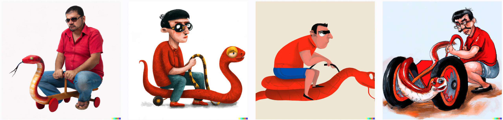
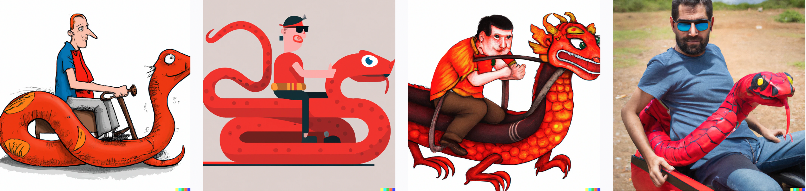
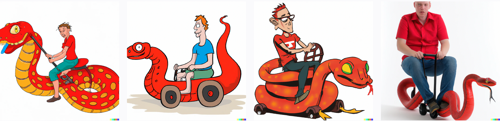
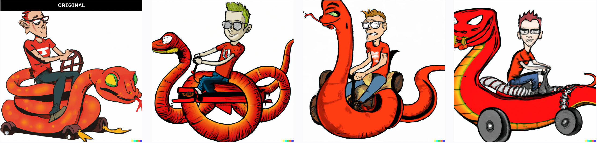

Статья: Trickster VPN. Разбираемся с WireGuard и делаем свой умный VPN
Идея: Поиграть с логотипом Wiregiard-a — змеем. Пусть с ни что-то делает человек, похожий на програмииста. Первоначально вообще хотели назвать статью "укрощение одноглазого змея", но потом отказались. 

Базовые запросы упорно генерировали дракона с ногами, поэтому пришлось добавить к ним "no legs".
a man sits and drives a one-eyed red serpent with no legs

Ноги исчезли, но почему-то появились колесики. 

man driving a one-eyed red serpent with no legs by sitting on it

Видимо, раз "driving", то значит, водитель, а раз водитель — то чего-то колесного. 
Повторяем запрос еще раз и получаем на третьей картинке уже что-то интересное. 

Может быть, перерисовка даст еще что-нибудь?

Нет, лучше всего все же оригинал. 
